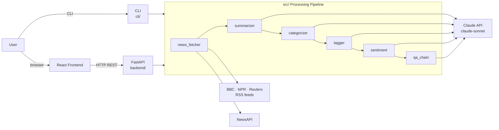
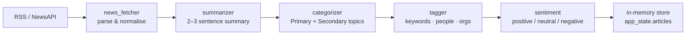
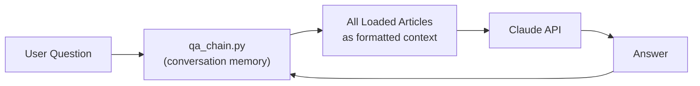

[](https://github.com/AlonNaor22/news-summarizer-agent/actions/workflows/ci.yml)
[](LICENSE)

# News Summarizer Agent

> Fetch, summarize, and chat with the latest news — powered by Claude AI.

Pull articles from RSS feeds (BBC, NPR, Reuters) or NewsAPI, run them through a Claude-powered pipeline that summarizes, categorizes, tags, and scores sentiment for each one, then ask natural-language questions about what's happening in the world. Available as a React web UI **and** a terminal CLI.

## Features

### Core Features
- **News Fetching**: Fetch articles from RSS feeds (BBC, NPR, Reuters) or NewsAPI
- **AI Summarization**: Uses Claude AI to generate concise summaries of each article
- **Topic Categorization**: Classifies articles into categories (Politics, Technology, Business, etc.)
- **Interactive Q&A**: Ask questions about the news with conversation memory for follow-ups

### Enhanced Features
- **Multiple News Sources**: Support for both RSS feeds and NewsAPI
- **Keyword & Entity Extraction**: Automatically extracts keywords, people, organizations, and locations
- **Search**: Search articles by keyword across titles, summaries, and tags
- **Export**: Save articles as JSON or Markdown files
- **Statistics**: View word counts, reading times, and category breakdowns
- **Date Filtering**: Filter articles by today, yesterday, week, or month

### Advanced Features
- **Sentiment Analysis**: Analyze the emotional tone of articles (positive/negative/neutral)
- **Trending Topics**: Detect hot topics across all articles using AI
- **Similar Articles**: Find related articles using keyword and entity matching
- **Multi-Source Comparison**: Compare how different news sources cover the same story

### Web Interface (NEW!)
- **Modern React Dashboard**: Beautiful, responsive UI built with React and Vite
- **Loading Feedback**: Progress indicator while articles are being fetched and processed
- **Sentiment Distribution Bars**: Visual breakdown of positive/negative/neutral coverage by category
- **Chat Interface**: Ask questions about your news in a conversational UI
- **Per-Source Coverage Breakdown**: See how different sources cover the same story

## Architecture



## How It Works

### Article Processing Pipeline

Each fetch request runs articles through a sequential pipeline of Claude-powered steps:



### Q&A Flow

When you ask a question, the loaded articles become the LLM context:



## Quick Start (Web Interface)

### Prerequisites

- Python 3.9 or higher
- Node.js 18 or higher
- An Anthropic API key ([get one here](https://console.anthropic.com/))
- (Optional) A NewsAPI key ([get one here](https://newsapi.org/))

### Installation

1. **Clone the repository**
   ```bash
   git clone https://github.com/AlonNaor22/news-summarizer-agent.git
   cd news-summarizer-agent
   ```

2. **Set up Python environment**
   ```bash
   python -m venv venv

   # Windows
   venv\Scripts\activate

   # macOS/Linux
   source venv/bin/activate

   # Core CLI dependencies
   pip install -r requirements.txt

   # Backend (FastAPI) dependencies
   pip install -r backend/requirements.txt
   ```

3. **Set up your API key**
   ```bash
   # Copy the example env file
   cp .env.example .env

   # Edit .env and add your API keys
   # ANTHROPIC_API_KEY=sk-ant-api03-xxxxx
   # NEWS_API_KEY=xxxxx (optional)
   ```

4. **Install frontend dependencies**
   ```bash
   cd frontend
   npm install
   # (Optional) copy and edit the env file if the backend runs on a non-default URL
   cp .env.example .env   # then set VITE_API_URL if needed
   cd ..
   ```

5. **Start the application**

   **Option A: Using the startup script (Windows)**
   ```cmd
   start.bat
   ```

   **Option B: Manual start (two terminals)**

   Terminal 1 - Backend:
   ```bash
   # From project root
   python -m uvicorn backend.main:app --reload --port 8000
   ```

   Terminal 2 - Frontend:
   ```bash
   cd frontend
   npm run dev
   ```

6. **Open the app**
   - Frontend: http://localhost:5173
   - API Docs: http://localhost:8000/docs

## Web Interface Screenshots

### Dashboard
The main dashboard shows:
- Fetch controls to get news from RSS/NewsAPI
- Article count and sentiment statistics
- Sentiment distribution chart
- Trending keywords
- Categories breakdown

### Articles Page
- Browse all fetched articles
- Filter by category, sentiment, or source
- Search by keyword
- Click to view article details

### Article Detail
- Full summary with sentiment analysis
- Keywords and entity tags
- Similar articles suggestions
- Link to original source

### Trending Page
- AI-detected themes and patterns
- Keyword frequency cloud
- Trending people, organizations, and locations

### Compare Page
- Find stories covered by multiple sources
- AI comparison of coverage differences
- Identify potential bias

### Chat Page
- Ask questions about your news
- Conversational memory for follow-ups
- Suggested questions to get started

## CLI Usage (Alternative)

You can still use the command-line interface:

```bash
python main.py
```

### Available Commands

| Command | Description |
|---------|-------------|
| `fetch` | Fetch news from RSS feeds |
| `fetch newsapi` | Fetch from NewsAPI |
| `show` | Display all articles |
| `sentiment` | Show sentiment breakdown |
| `trending` | Detect trending topics |
| `similar <n>` | Find similar articles |
| `compare` | Compare multi-source stories |
| `ask <question>` | Ask about the articles |
| `help` | Show all commands |

## Project Structure

```
news-summarizer-agent/
├── main.py                 # CLI entry point
├── config.py               # Configuration settings
├── requirements.txt        # Python dependencies
├── start.bat               # Windows startup script
├── start.sh                # macOS/Linux startup script
│
├── backend/                # FastAPI backend (NEW!)
│   ├── main.py             # FastAPI app entry point
│   ├── requirements.txt    # Backend dependencies
│   └── api/
│       ├── dependencies.py # Shared state management
│       └── routes/
│           ├── articles.py # Article endpoints
│           ├── sentiment.py# Sentiment endpoints
│           ├── trending.py # Trending endpoints
│           ├── similarity.py # Similar articles
│           ├── comparison.py # Source comparison
│           └── qa.py       # Q&A endpoints
│
├── frontend/               # React frontend (NEW!)
│   ├── package.json
│   ├── vite.config.js
│   └── src/
│       ├── App.jsx
│       ├── services/
│       │   └── api.js      # API client
│       ├── components/
│       │   ├── Navbar.jsx
│       │   ├── ArticleCard.jsx
│       │   ├── SentimentBadge.jsx
│       │   └── ...
│       └── pages/
│           ├── Dashboard.jsx
│           ├── Articles.jsx
│           ├── ArticleDetail.jsx
│           ├── Trending.jsx
│           ├── Compare.jsx
│           └── Chat.jsx
│
├── src/                    # Core AI modules
│   ├── news_fetcher.py     # RSS + NewsAPI fetching
│   ├── summarizer.py       # Claude AI summarization
│   ├── categorizer.py      # Topic classification
│   ├── tagger.py           # Keyword extraction
│   ├── sentiment.py        # Sentiment analysis
│   ├── trending.py         # Trend detection
│   ├── similarity.py       # Article relationships
│   ├── comparator.py       # Multi-source comparison
│   └── qa_chain.py         # Q&A with memory
│
└── output/                 # Saved summaries
```

## API Endpoints

The FastAPI backend provides these endpoints:

| Endpoint | Method | Description |
|----------|--------|-------------|
| `/api/fetch` | POST | Fetch and process articles |
| `/api/articles` | GET | Get all articles (with filters) |
| `/api/articles/{id}` | GET | Get single article |
| `/api/sentiment` | GET | Sentiment summary |
| `/api/trending` | GET | Trending topics |
| `/api/articles/{id}/similar` | GET | Similar articles |
| `/api/comparison` | GET | Source comparisons |
| `/api/qa/ask` | POST | Ask a question |

Full API documentation available at http://localhost:8000/docs

## Running Tests

```bash
pip install -r requirements-dev.txt
pytest tests/ -v
```

## Technologies Used

### Backend
- **[FastAPI](https://fastapi.tiangolo.com/)** - Modern Python web framework
- **[LangChain](https://python.langchain.com/)** - AI application framework
- **[Claude AI](https://www.anthropic.com/claude)** - Large language model
- **[feedparser](https://feedparser.readthedocs.io/)** - RSS feed parsing
- **[NewsAPI](https://newsapi.org/)** - News aggregator API

### Frontend
- **[React](https://react.dev/)** - UI framework
- **[Vite](https://vitejs.dev/)** - Build tool
- **[React Router](https://reactrouter.com/)** - Client-side routing
- **[Axios](https://axios-http.com/)** - HTTP client

## Configuration

Edit `config.py` to customize:

```python
# Change the Claude model
MODEL_NAME = "claude-sonnet-4-5-20250929"

# Add more RSS feeds
RSS_FEEDS = {
    "BBC News": "http://feeds.bbci.co.uk/news/rss.xml",
    "Your Source": "https://example.com/rss",
}

# Modify categories
CATEGORIES = ["Politics", "Business", "Technology", ...]
```

## Troubleshooting

### "ANTHROPIC_API_KEY not found"
Create a `.env` file with your API key:
```
ANTHROPIC_API_KEY=sk-ant-api03-your-key-here
```

### Backend won't start
Make sure you've installed backend dependencies:
```bash
pip install -r backend/requirements.txt
```

### Frontend won't start
Make sure you've installed Node.js dependencies:
```bash
cd frontend
npm install
```

### CORS errors in browser
Make sure the backend is running on port 8000 before starting the frontend.

## Limitations / Known Issues

These are honest trade-offs in the current implementation — the kind of things you'd address before scaling beyond a personal demo:

- **In-memory state**: articles and Q&A history are held in RAM and lost whenever the backend restarts.
- **Single-user backend**: `app_state` in `backend/api/dependencies.py` is a module-level singleton — multiple concurrent users share the same articles and conversation history.
- **No authentication**: any client that can reach the server can read, overwrite, or clear articles.
- **No rate limiting**: `POST /api/fetch` fires one Claude API call per article; a large fetch can rack up API costs quickly.
- **Sequential processing**: `summarize_articles`, `categorize_articles`, `tag_articles`, and `analyze_sentiments` loop articles one at a time; `asyncio.gather` + `.ainvoke` could reduce wall-clock time 5–10×.

## Contributing

Contributions are welcome! Feel free to:
- Add new features
- Improve the UI
- Fix bugs
- Improve documentation

## License

MIT License - feel free to use this project for learning and building your own applications.

## Acknowledgments

- Built with [LangChain](https://langchain.com/) and [Claude AI](https://anthropic.com/)
- News content from BBC, NPR, Reuters RSS feeds and NewsAPI
